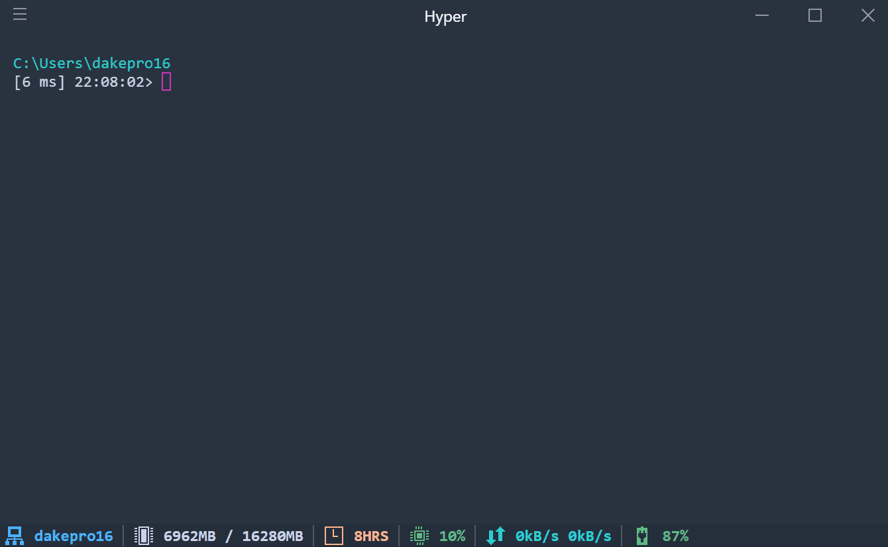

# My Powershell environment

## Install

```powershell
Set-ExecutionPolicy -ExecutionPolicy Unrestricted -Scope CurrentUser
.\install.ps1
```

## Features

---

### Tab completion

The default powershell tab completion is overridden to provide recursive file and directory search.



*Notice CPU usage on the first tab - it utilizes all available resources for the fastest file search.*

---

### Auto install

The following tools are automatically installed, with aliases (shortcuts) for easy access:

* Visual Studio Code (shortcut: 'vs')
* Notepad++ (shortcut: 'sn', as in 'Show Notepad')
* Nuget

### Prompt

Nothing spectacular, here is what is preconfigured:

* Git status - uses posh-git module, installed and preconfigured for convenience.
* Timestamp - useful when you trigger long running command, but forgot to time it.
* Duration - since this prompt is not trivial, it is important to actually track how long it took to generate the prompt.
